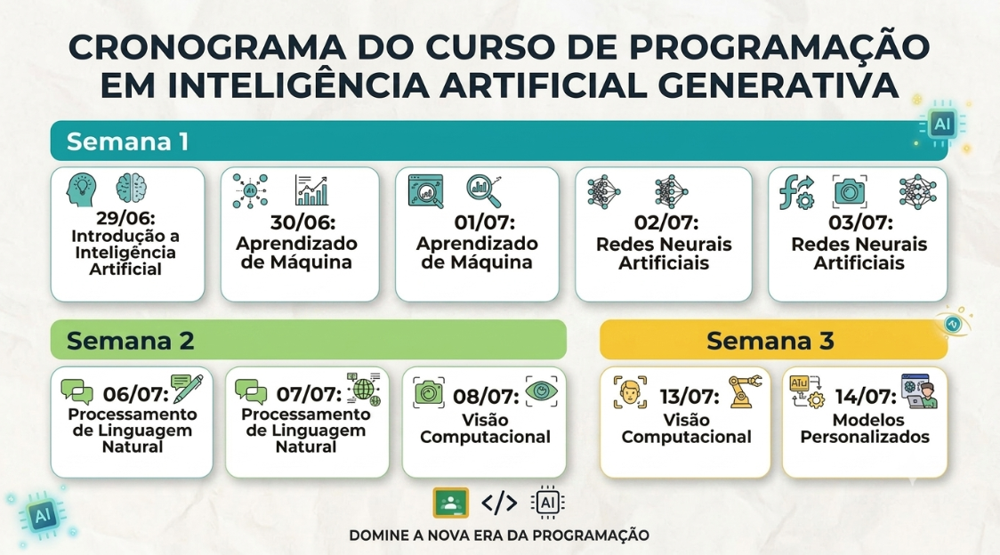

# Programação em Inteligência Artificial Generativa - SENAI

Repositório criado para registrar os códigos, projetos, exercícios e notas de estudo desenvolvidos ao longo do curso de Aperfeiçoamento Profissional em **Programação em Inteligência Artificial Generativa** ministrado pelo SENAI-SP.

---

## Cronograma de Aulas

O cronograma detalhado de distribuição de aulas e módulos do curso está documentado na imagem abaixo:

## Objetivo do Curso

Implementar soluções de software por meio de inteligência artificial generativa, identificando e corrigindo erros comuns em aplicações, reescrevendo códigos com o intuito de melhorar a compreensão de sua escrita e o desempenho geral da aplicação, aprimorando e acelerando o aprendizado de novas tecnologias.

---

## Conteúdo Programático & Tecnologias Abordadas

A ementa técnica do curso está dividida nos seguintes pilares fundamentais de Inteligência Artificial:

### 1. Inteligência Artificial
- **Tópicos:** Definição, História, Aplicação e Ética em IA.

### 2. Aprendizado de Máquina (Machine Learning)
- **Modelos:** Supervisionado, Não Supervisionado e Por Reforço.
- **Ciclo de Desenvolvimento:** Coleta de Dados, Pré-processamento e Avaliação de modelos.
- **Implementação Prática:** `Scikit-learn`

### 3. Redes Neurais Artificiais (Deep Learning)
- **Tópicos:** Arquitetura, Treinamento e Mecanismos de Redes Profundas.
- **Implementação Prática:** `TensorFlow`, `Keras` e `Dialogflow`.

### 4. Processamento de Linguagem Natural (PLN / NLP)
- **Modelagem:** Estruturação de textos e técnicas de Análise de Sentimentos.
- **Implementação Prática:** `NLTK` e `spaCy`.

### 5. Visão Computacional
- **Tópicos:** Algoritmos de Detecção de Objetos e Reconhecimento Facial.
- **Implementação Prática:** `OpenCV`, `YOLO` e integração com `STT` (Speech to Text).

### 6. Modelos Personalizados
- **Tópicos:** Desenho de Arquitetura de Redes, Conexão com ambientes em Nuvem (Cloud) e Otimização Avançada de Resultados.

---

## Stack Tecnológica Utilizada

- **Linguagem Principal:** Python 3.13
- **Ambientes de Desenvolvimento:** Jupyter Notebooks / VS Code
- **Bibliotecas Chave:**
  - `scikit-learn` (Machine Learning Tradicional)
  - `tensorflow` / `keras` (Deep Learning)
  - `nltk` / `spacy` (Processamento de Linguagem Natural)
  - `opencv-python` / `ultralytics` (YOLO - Visão Computacional)

---

## Desenvolvimento de Capacidades Socioemocionais

Além do forte viés tecnológico, o programa incentiva e avalia competências essenciais de mercado:
* **Autogestão** e **Autonomia** no aprendizado continuado.
* **Pensamento Analítico** e **Raciocínio Lógico** aplicados na resolução de problemas complexos.
* **Inteligência Emocional** no desenvolvimento de soluções colaborativas.

---